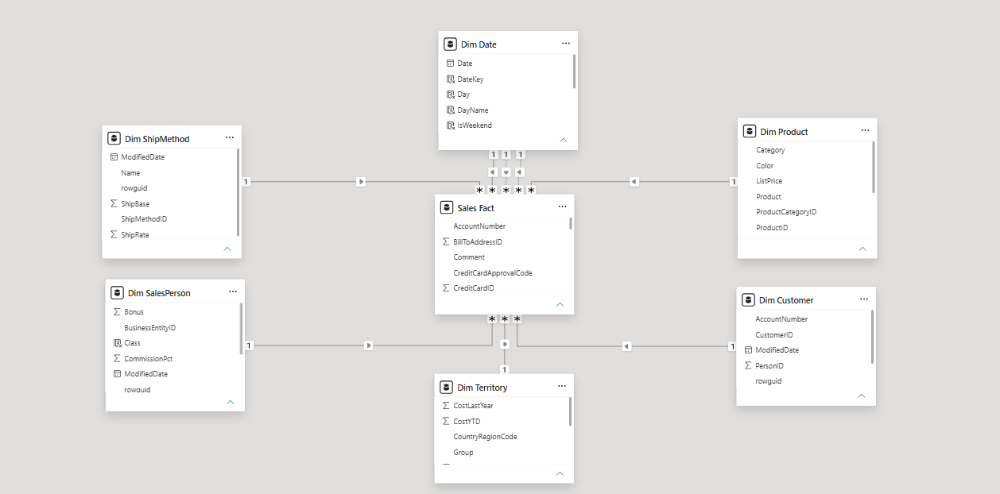
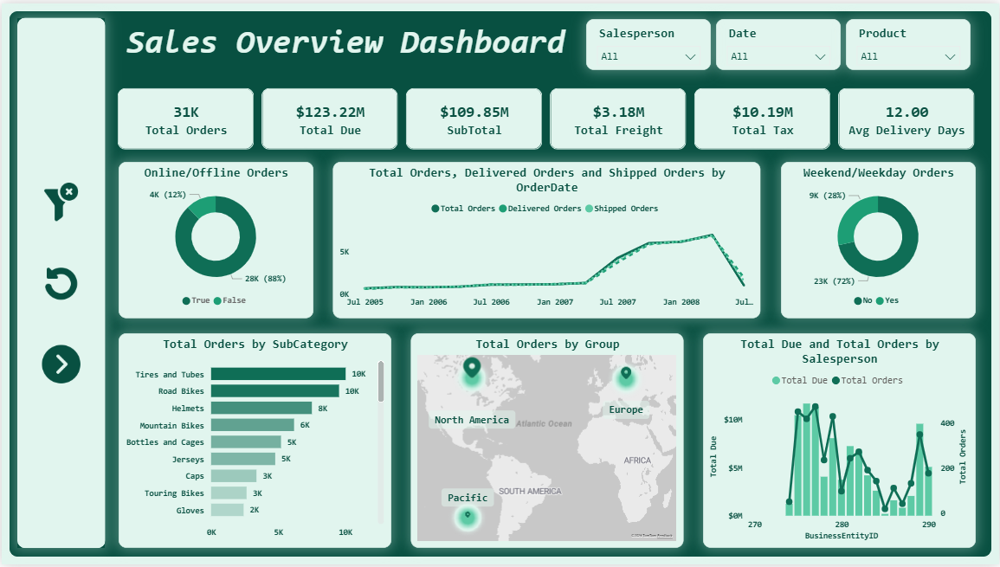
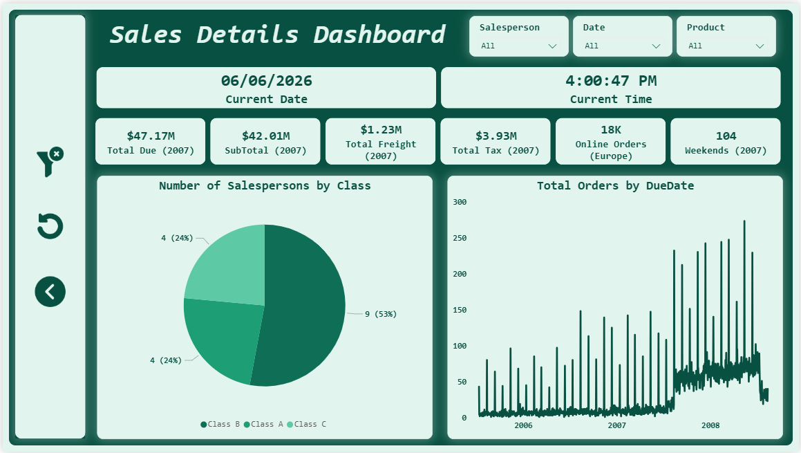

# 📊 Sales Performance Power BI Dashboards

> A project I completed during my Power BI Development Training at the Information Technology Institue (ITI) — two fully interactive Power BI dashboards built on a clean star schema data model to analyze sales performance from both a high-level and detailed perspective.

---

## 🖼️ Dashboard Previews

### Data Model — Star Schema

### Dashboard 1: Sales Overview

### Dashboard 2: Sales Details

---

## 📌 Overview

This project covers the full Power BI development pipeline — from raw data to a polished, interactive report. It demonstrates skills in **data cleaning**, **data modeling**, **DAX**, and **dashboard design**, producing flexible analytics solutions that support data-driven decision-making.

---

## 🗃️ Data Model

A **star schema** was designed with one central fact table surrounded by six dimension tables:

| Table | Type | Description |
|---|---|---|
| **Sales Fact** | Fact | Core transactional sales data |
| **Dim Date** | Dimension | Calendar table for time intelligence |
| **Dim Product** | Dimension | Product categories and details |
| **Dim Customer** | Dimension | Customer information |
| **Dim SalesPerson** | Dimension | Salesperson details and class |
| **Dim Territory** | Dimension | Geographic region and group |
| **Dim ShipMethod** | Dimension | Shipping method and rates |

---

## 🗂️ Dashboard Breakdown

### Dashboard 1️⃣ — Sales Overview

A high-level view of overall sales performance, featuring:

- **KPI Cards:** Total Orders, Total Due, SubTotal, Total Freight, Total Tax, Avg Delivery Days
- **Online vs Offline Orders** — donut chart breakdown
- **Weekend vs Weekday Orders** — donut chart breakdown
- **Order Trends Over Time** — Total, Delivered, and Shipped Orders by Order Date
- **Orders by SubCategory** — horizontal bar chart with drill-down
- **Orders by Geographic Group** — world map visualization
- **Total Due & Total Orders by Salesperson** — dual axis chart for performance comparison

### Dashboard 2️⃣ — Sales Details

A granular, time-aware view of sales data, featuring:

- **Live Date & Time indicators** — current date and time displayed dynamically
- **Dynamic KPI Cards** filtered by year and region (Total Due, SubTotal, Freight, Tax, Online Orders, Weekend Orders)
- **Salesperson Segmentation by Class** — pie chart (Class A, B, C)
- **Total Orders by Due Date** — detailed time series with drill-down capabilities

---

## ⚙️ Key Features & Techniques

| Feature | Description |
|---|---|
| **Power Query** | Data cleaning and transformation of raw data |
| **Star Schema** | Fact + 6 dimension tables for optimized modeling |
| **DAX Measures** | Custom KPIs and business calculations |
| **Dynamic Slicers** | Filter by Salesperson, Date, and Product |
| **Navigation Buttons** | Seamless movement between dashboards |
| **Bookmarks** | Clear visual interactions with one click |
| **Reset Button** | Instantly clears all active slicers |
| **Drill-Down** | Deeper exploration in product and time visuals |
| **Consistent UI Design** | Clean, branded green theme across all pages |

---

## 🛠️ Tools & Skills Used

- **Power BI Desktop**
- **Power Query** — data transformation and cleaning
- **DAX** — measures, KPIs, time intelligence
- **Data Modeling** — star schema design
- **Power BI Service**

---

